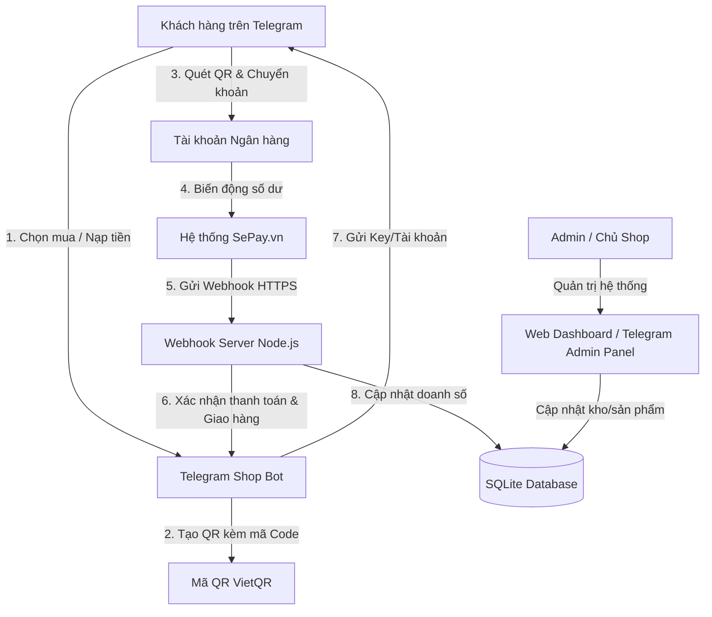

# 🚀 ĐỀ XUẤT GIẢI PHÁP & PHƯƠNG ÁN KINH DOANH: HỆ THỐNG TELEGRAM SHOP BOT TỰ ĐỘNG
*(Tài liệu thương mại dành cho đối tác và chủ sở hữu dự án)*

---

## I. GIỚI THIỆU CHUNG & BỐI CẢNH THỊ TRƯỜNG

Trong kỷ nguyên số hóa, nhu cầu giao dịch và mua bán sản phẩm kỹ thuật số (tài khoản phần mềm, key kích hoạt, mã giảm giá, proxy, tài liệu...) đang tăng trưởng bùng nổ. Tuy nhiên, các nhà bán hàng cá nhân và doanh nghiệp nhỏ thường gặp phải những rào cản lớn:
*   **Tỷ lệ hủy đơn cao**: Khách hàng phải chờ đợi Admin xác nhận chuyển khoản thủ công.
*   **Vận hành cồng kềnh**: Phải trực tin nhắn 24/7 để gửi tài khoản/key cho khách hàng.
*   **Chi phí hệ thống lớn**: Xây dựng website thương mại điện tử chuyên nghiệp đòi hỏi chi phí thiết kế, hosting, bảo trì phức tạp.
*   **Trải nghiệm khách hàng kém**: Quy trình mua hàng nhiều bước trên web di động không tối ưu bằng ứng dụng chat trực tiếp.

**Giải pháp của chúng tôi**: **DVTT Shop Bot** — Một hệ sinh thái khép kín kết hợp giữa sự tiện lợi của **Telegram Bot**, hệ thống xác thực thanh toán tự động qua **Ngân hàng (VietQR + SePay)** và bảng điều khiển quản trị **Web Dashboard cao cấp**.

---

## II. GIÁ TRỊ CỐT LÕI & ƯU THẾ CẠNH TRANH (USP)

### 1. Bán hàng tự động 100% không cần con người can thiệp
*   **Khách hàng**: Chọn sản phẩm -> Nhận mã QR thanh toán -> Chuyển khoản -> Nhận tài khoản/key ngay lập tức trên khung chat.
*   **Chủ cửa hàng**: Chỉ cần nạp kho hàng một lần, hệ thống tự động bán và đối soát dòng tiền 24/7, ngay cả khi bạn đang ngủ.

### 2. Tích hợp thanh toán thông minh VietQR + SePay
*   Tự động sinh mã QR chứa sẵn số tiền và nội dung chuyển khoản chính xác tuyệt đối.
*   Không yêu cầu tích hợp cổng thanh toán quốc tế đắt đỏ hay thủ tục phức tạp. Dòng tiền chảy trực tiếp về tài khoản ngân hàng cá nhân của chủ shop.
*   Xử lý giao dịch chỉ trong **3 - 5 giây** nhờ webhook của SePay.

### 3. Hai phương thức thanh toán linh hoạt
*   **Mua trực tiếp**: Quét QR thanh toán trực tiếp cho từng đơn hàng (phù hợp với khách vãng lai).
*   **Số dư ví (Wallet)**: Nạp tiền trước vào tài khoản Telegram qua lệnh `/nap`, sau đó thanh toán trừ dần cực nhanh chỉ với 1 lượt nhấp chuột (tăng tỷ lệ giữ chân khách quay lại).

### 4. Bảng điều khiển Web Dashboard đẳng cấp
*   Giao diện Glassmorphism Dark Mode thời thượng, trực quan trên mọi thiết bị.
*   Thống kê doanh thu, đơn hàng, biểu đồ tăng trưởng doanh số 7 ngày gần nhất bằng Chart.js.
*   Quản lý danh mục, thêm/sửa/xóa sản phẩm, nạp kho hàng (stock) bằng file text cực kỳ nhanh chóng mà không cần mở Telegram.
*   Bảo mật tuyệt đối thông qua hệ thống **xác thực mã OTP gửi thẳng về Telegram Admin**.

---

## III. CHI TIẾT CÁC TÍNH NĂNG KỸ THUẬT

### 1. Phân hệ Khách hàng (Telegram Bot)
*   Hiển thị danh sách sản phẩm đẹp mắt, phân loại theo danh mục tiện lợi.
*   Hệ thống giỏ hàng và chọn số lượng trực quan.
*   Quản lý lịch sử mua hàng, tra cứu 5 đơn hàng gần nhất tức thì.
*   Liên kết hỗ trợ nhanh với admin bằng một nút bấm `/support`.

### 2. Phân hệ Quản trị (Telegram Admin Commands)
*   Quản lý nhanh: Cấp số dư cho khách, trừ tiền ví, bật/tắt bán hàng, gửi thông báo hàng loạt (Broadcast) cho toàn bộ khách hàng bằng định dạng HTML.
*   Nhận thông báo tức thời bằng tiếng Việt ngay khi có giao dịch nạp tiền thành công hoặc đơn hàng được giao.

### 3. Phân hệ Quản trị (Web Dashboard)
*   Thống kê KPI thời gian thực: Doanh thu, số lượng đơn hoàn thành, số lượng người dùng, tổng tồn kho thực tế.
*   Hệ thống cảnh báo tồn kho thấp (Low stock/Out of stock) bằng các thanh tiến trình trực quan giúp admin nhận biết sản phẩm nào cần bổ sung gấp.
*   Quản lý cơ sở dữ liệu sản phẩm trực quan (Add/Edit/Delete/Toggle Active).

---

## IV. PHƯƠNG ÁN TRIỂN KHAI VÀ CHI PHÍ VẬN HÀNH

Giải pháp được thiết kế tối ưu hóa chi phí phần cứng và dịch vụ bên thứ ba để đảm bảo **tỷ suất lợi nhuận (ROI) cao nhất**:

### 1. Chi phí hạ tầng (Ước tính)
*   **Máy chủ (VPS Hostinger / Render)**: Khoảng **50.000đ - 120.000đ/tháng** (Sử dụng gói KVM VPS 1 của Hostinger là hoàn hảo cho 10.000+ khách hàng).
*   **Cổng đối soát giao dịch (SePay)**: Miễn phí gói cơ bản (tối đa 200 giao dịch/tháng) hoặc phí rất nhỏ khoảng **50.000đ - 100.000đ/tháng** cho gói chuyên nghiệp không giới hạn.
*   **Tên miền (Domain)**: Khoảng **150.000đ - 300.000đ/năm** (dùng cho Web Dashboard quản trị và Webhook nhận diện thanh toán bảo mật SSL).
*   **Tổng chi phí duy trì**: Chỉ từ **100.000đ - 200.000đ/tháng** để sở hữu một cỗ máy bán hàng tự động 24/7.

### 2. Kế hoạch triển khai (3 Bước)
*   **Bước 1**: Đăng ký VPS và cấu hình Node.js + HTTPS (Chứng chỉ SSL miễn phí từ Let's Encrypt).
*   **Bước 2**: Liên kết tài khoản ngân hàng của bạn lên SePay và cấu hình Webhook trỏ về máy chủ VPS.
*   **Bước 3**: Cấu hình các biến môi trường tại `.env` (Token Telegram Bot, Admin ID...) và chạy ứng dụng ngầm bằng `PM2`.

---

## V. CHIẾN LƯỢC PHÁT TRIỂN & TIẾP THỊ (MARKETING STRATEGY)

Để thu hút khách hàng và gia tăng doanh số nhanh chóng sau khi hệ thống hoạt động:

1.  **Chia sẻ Bot lên các hội nhóm Cộng đồng**: Chia sẻ liên kết Bot vào các nhóm Zalo, Facebook, Telegram chuyên về MMO, Dropshipping, phần mềm bản quyền hoặc học tập.
2.  **Chính sách tặng tiền trải nghiệm**: Cài đặt cộng sẵn 2.000đ - 5.000đ vào ví số dư khi người dùng mới nhấn `/start` lần đầu để kích thích họ dùng thử dịch vụ mua key giá rẻ.
3.  **Tối ưu hóa nội dung mô tả sản phẩm**: Điền thông tin hướng dẫn sử dụng rõ ràng, cam kết bảo hành lỗi 1 đổi 1 trực tiếp trên khung chat để tạo dựng uy tín tuyệt đối với khách hàng.
4.  **Chiến dịch gửi tin nhắn hàng loạt (Broadcast)**: Tận dụng tính năng `/broadcast` để gửi mã giảm giá, thông báo hàng mới về hoặc chương trình khuyến mãi cuối tuần tới hàng ngàn khách hàng đã từng tương tác với Bot mà không tốn chi phí SMS marketing.

---

*Hệ thống **DVTT Shop Bot** không chỉ là một công cụ công nghệ, mà là một **giải pháp chuyển đổi số bán hàng** tinh gọn, hoạt động bền bỉ, giúp các chủ shop giải phóng sức lao động và tối đa hóa dòng tiền thụ động.*
