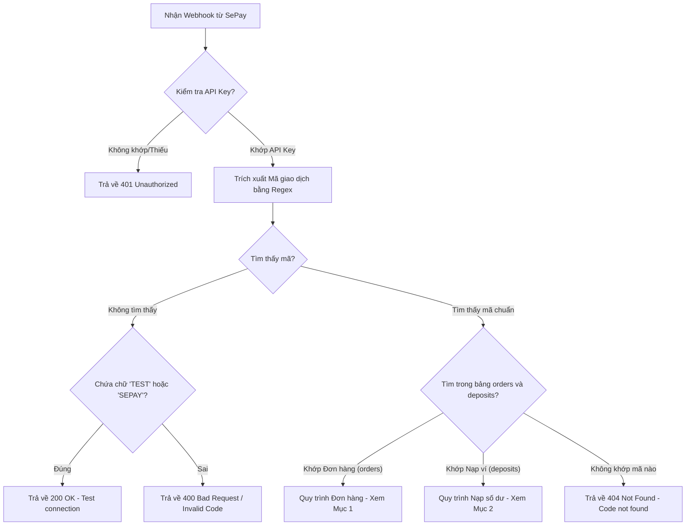
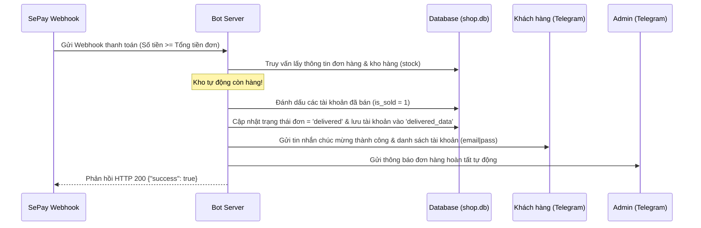
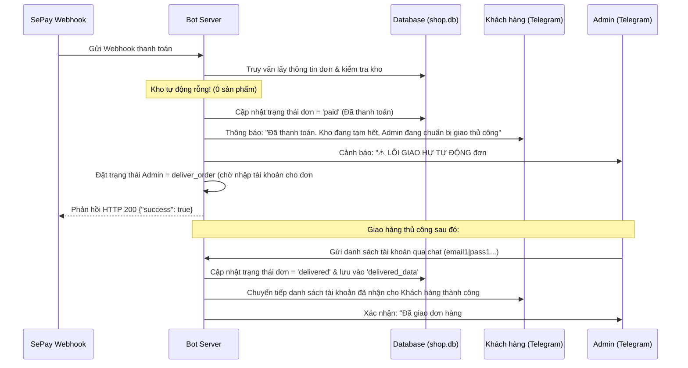
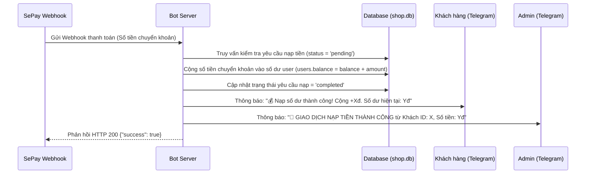
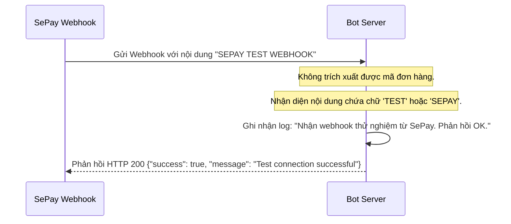

# 📖 QUY TRÌNH NGHIỆP VỤ THANH TOÁN (SEPAY WEBHOOK WORKFLOWS)

Tài liệu này mô tả chi tiết quy trình xử lý dữ liệu của Telegram Shop Bot khi nhận được tín hiệu thông báo nhận tiền từ hệ thống SePay Webhook.

---

## 🗺️ Quy trình tổng quan (Tổng thể)

Khi có biến động số dư tài khoản ngân hàng, SePay sẽ gửi một `HTTP POST` request chứa thông tin giao dịch về endpoint `/webhook/sepay` của Bot. Quy trình xử lý diễn ra như sau:

---

## 📦 1. Quy trình xử lý Đơn hàng (Orders)

Khi mã giao dịch (ví dụ: `NAP PAY-1TVWQ8`) khớp với một đơn hàng đang chờ thanh toán trong bảng `orders`:

### Trường hợp 1.1: Đơn hàng đủ kho tự động (Giao hàng tự động - Auto Delivery)
Áp dụng khi số lượng sản phẩm trong bảng `stock` lớn hơn hoặc bằng số lượng sản phẩm khách hàng đặt.

### Trường hợp 1.2: Đơn hàng hết kho tự động (Chờ giao thủ công - Manual Queue)
Áp dụng khi số lượng sản phẩm trong bảng `stock` rỗng hoặc không đủ số lượng đặt.

---

## 💰 2. Quy trình Nạp số dư vào ví (Deposits)

Áp dụng khi mã giao dịch (ví dụ: `NAP PAY-XYZ123`) khớp với một yêu cầu nạp tiền được tạo qua lệnh `/nap [số tiền]` trong bảng `deposits`.

---

## 🛠️ 3. Quy trình Kiểm thử Kết nối (Test Ping)

Áp dụng khi bạn nhấn nút **"Kiểm tra kết nối"** hoặc **"Gửi thử"** trên bảng điều khiển SePay.

---

## 🔍 Hướng dẫn xử lý sự cố (Troubleshooting)

*   **Hiện tượng 1: SePay báo lỗi gửi thất bại (HTTP 401)**
    *   *Nguyên nhân:* API Key cấu hình trên SePay và file `.env` không khớp.
    *   *Khắc phục:* Đảm bảo tham số Authorization trên SePay có định dạng `Apikey [MÃ_KEY]` và khớp từng ký tự với `SEPAY_API_KEY` trong `.env`.
*   **Hiện tượng 2: SePay báo lỗi gửi thất bại (HTTP 404)**
    *   *Nguyên nhân:* Mã nội dung chuyển khoản gửi sang không khớp với bất kỳ đơn hàng hoặc yêu cầu nạp tiền đang hoạt động nào trong cơ sở dữ liệu (hoặc do đơn hàng đó đã bị hủy/hoàn thành trước đó).
    *   *Khắc phục:* Tạo một đơn hàng mới từ Telegram để có mã thanh toán mới tinh rồi giả lập lại.
*   **Hiện tượng 3: SePay báo lỗi Timeout (Không kết nối được)**
    *   *Nguyên nhân:* Máy chủ webhook của Bot chưa được bật, hoặc cổng `3000` bị chặn bởi tường lửa, hoặc đường hầm (localtunnel/localhost.run) đã bị ngắt kết nối.
    *   *Khắc phục:* Kiểm tra xem lệnh `ssh -R ... nokey@localhost.run` trong terminal còn chạy không, và đảm bảo URL Webhook cấu hình trên SePay đã được cập nhật đúng địa chỉ mới nhất.
